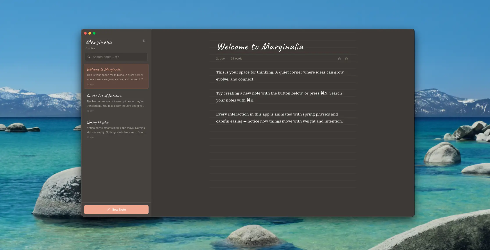

# Marginalia

A simple note-taking app. Nothing more, nothing less.



Open it. Write something. Close it. Your notes are still there next time. That's it.

No accounts. No cloud. No syncing. No folders, tags, databases, or settings pages. Just you and your thoughts, stored locally on your machine.

Inspired by marginalia — the notes scholars have scribbled in book margins for centuries. Quick, personal, unpretentious.

## What it does

- Write notes with **bold**, **italic**, and **underline**
- Pin, reorder, search, and export
- Light and dark mode
- Undo accidental deletes
- Runs in the browser or as a macOS desktop app

## Keyboard Shortcuts

| Shortcut | Action |
|---|---|
| `Cmd + N` | New note |
| `Cmd + K` | Search notes |
| `Cmd + B` | Bold |
| `Cmd + I` | Italic |
| `Cmd + U` | Underline |
| `Cmd + Z` | Undo delete |

## Tech Stack

- [Next.js 16](https://nextjs.org/) — App Router, static export
- [React 19](https://react.dev/)
- [TypeScript](https://www.typescriptlang.org/)
- [Tailwind CSS v4](https://tailwindcss.com/)
- [Framer Motion](https://www.framer.com/motion/)
- [Electron](https://www.electronjs.org/) — macOS desktop app

## Getting Started

```bash
# Install dependencies
npm install

# Run the dev server
npm run dev

# Run the Electron app in dev mode
npm run dev:electron
```

## Building

```bash
# Build the web app
npm run build

# Build and package the macOS app (.dmg)
npm run dist
```

> **Note:** The macOS app is not code-signed. After installing, run:
> ```bash
> xattr -dr com.apple.quarantine /Applications/Marginalia.app
> ```

## License

MIT
